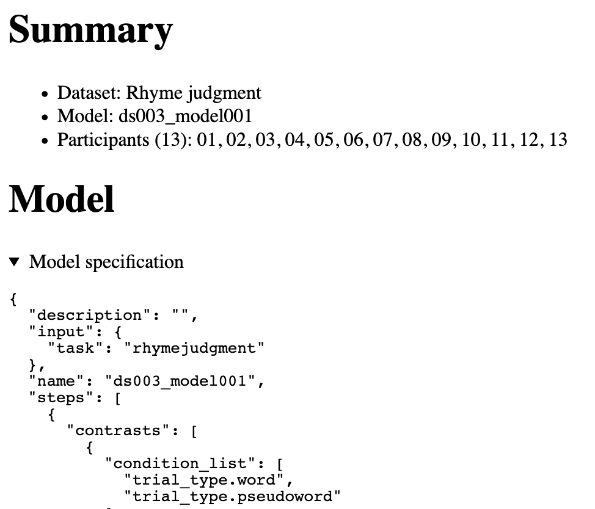
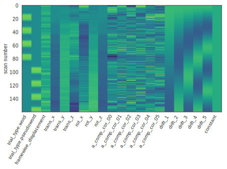
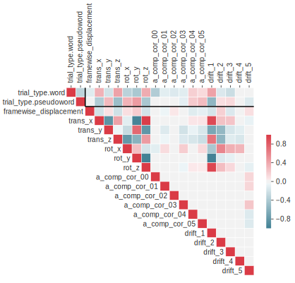
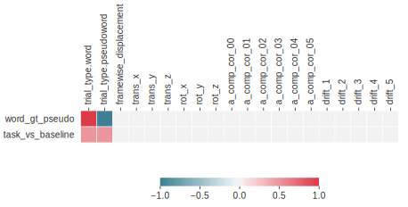
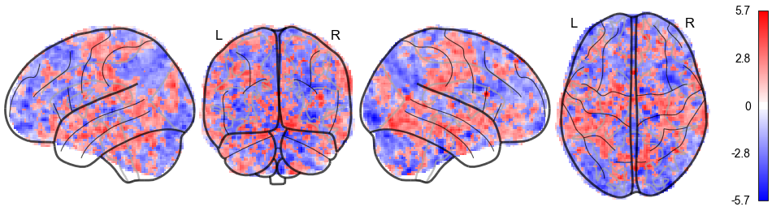

class: center middle

# FitLins - Reproducible model estimation for fMRI
### Christopher J. Markiewicz
#### Center for Reproducible Neuroscience
#### Stanford University

###### [effigies.github.io/fitlins-demo](https://effigies.github.io/fitlins-demo)

---
name: footer
layout: true

<div class="slide-slug">OHBM 2019 &mdash;
<a href="https://effigies.github.io/fitlins-demo">effigies.github.io/fitlins-demo</a></div>
---


.left-column[
# FitLins
### What is it?
]
.right-column[

## A BIDS-aware GLM-estimation framework

### BIDS-Aware

* BIDS is a set of community-developed standards for organizing neuroimaging
  data
  * [BIDS-Raw](https://bids-specification.readthedocs.io) - structures MRI data,
    task *events*, physiological *time series*, etc.
  * [BIDS-Derivatives](https://bids-specification.readthedocs.io/en/derivatives/) - structures
    preprocessed *BOLD series*, confound *time series*, etc.
  * [BIDS-Stats
     Models](https://docs.google.com/document/d/1bq5eNDHTb6Nkx3WUiOBgKvLNnaa5OMcGtD0AZ9yms2M) -
     describes a JSON structure for constructing design matrices and contrasts
* [PyBIDS](https://github.com/bids-standard/pybids/) queries datasets and interprets the
  model specification to produce design matrices

### Framework

* [Nipype](https://nipype.readthedocs.io) interfaces are used to provide well-defined I/O
  contracts, facilitating exchange of components.
* Reference implementations use [NiStats](https://nistats.github.io/) for estimation

]

---

.left-column[
# FitLins
### What is it?
### How do I use it?
]
.right-column[
## Brain Imaging Data Structure
* FitLins typically requires a BIDS-formatted dataset and
  a preprocessed dataset.
* Some example BIDS-StatsModels are available in the
  [documentation](https://fitlins.readthedocs.io/en/latest/).


### Python
```Bash
$ pip install fitlins
$ fitlins data/ output/ dataset \
    --derivatives preprocessed_data/ \
    --model model-label_smdl.json
```

### Docker
```Bash
$ docker pull poldracklab/fitlins
```

]


---
layout: true
template: footer

## Reports
---

### Read the Docs (if you want)

* [Report documentation](https://fitlins.readthedocs.io/en/latest/examples/reports.html)
  ([local copy](assets/docs/examples/reports.html))

---

The initial summary describes the model metadata and inputs.

<p align="center">

</p>

---

### Design matrix

.center[

]

---

### Regressor correlations

<p align="center">

</p>

---

### Contrast matrices

Contrasts are shown as a matrix of weights assigned to each regressor for each hypothesis.

<p align="center">

</p>

---

### Statistics

<p align="center">

</p>

t- or F-statistics are plotted in maximum-intensity projections (glass brains), which show the
statistic with greatest absolute value along the viewing axis at each point in the viewing plane.

---
layout: true
template: footer

## Models

---

* [Model documentation](https://fitlins.readthedocs.io/en/latest/model.html)
  ([local copy](assets/docs/model.html))

* [Neuroscout](https://alpha.neuroscout.org)
